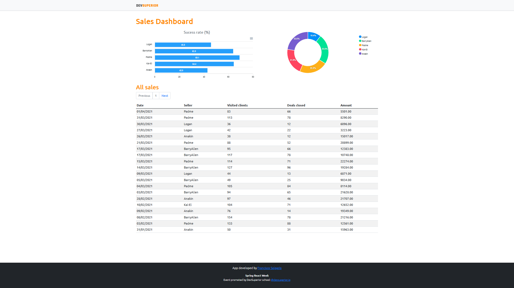

# Full Stack Practice Spring Boot ReactJS
## Simple Sales Dashboard

- Instructor: Nelio Alves
- Original repository: https://github.com/devsuperior/sds4
- Teaching platform: [DevSuperior - Escola de programação](https://devsuperior.com.br)
- Spring React Week 4

##  Applications

- Netlify: frontend
    - https://ciskowsales.netlify.app/
    - 
- Heroku: backend
    - https://sales-app-ciskow.herokuapp.com/

##  Objective

- First
    - Create application for back-end using Spring Boot
    - Create application for front-end using ReactJS
    - CI/CD with Netlify

- Second
    - Implement back-end

- Third
    - Integrate back-end and front-end

## Technologies used

- Java 11
- JavaScript
- TypeScript
- HTML
- CSS
- Bootstrap
- Google Fonts
- Apex Charts
- Spring Initializr
- Spring Boot
- Spring Tool Suite 4
- ReactJS
- Node.js
- Git
- Postman
- Heroku
- PostgreSQL / pgAdmin 4
- Yarn
- NPM
- Visual Studio Code
- Netlify
- Netlify CI/CD (Continuous Integration and Continuous Delivery)
- Standard layers (SOLID Concepts)
- Domain model
- Heroku
- React Hooks
- React Router DOM
- Axios

## Author

- Francisco Dionizio Salgado
- https://www.linkedin.com/in/franciscodsalgado/
